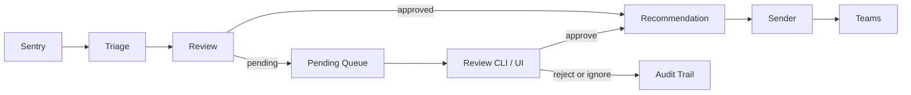

# Architecture

## Overview

The repo implements a staged alert-processing pipeline:

1. collect issues from Sentry
2. classify and prioritize them with rules plus optional AI
3. route high-priority issues through review
4. generate responder guidance for approved items
5. deliver notifications and write receipts

The system is intentionally file-oriented. Each stage writes artifacts into `output/`, which keeps the pipeline easy to inspect, replay, and review without introducing a database.

## Main Components

- `alert_agent/sources/sentry/`: source plugin for fetching and normalizing Sentry issues
- `alert_agent/pipeline/`: shared stage implementations for triage, review, recommendation, and sending
- `alert_agent/core/`: config loading, review queue helpers, Teams delivery, monitoring helpers, and shared models
- `agents/`: legacy-compatible agent entrypoints
- `scripts/`: orchestration, review tools, monitoring commands, and analysis utilities

## End-to-End Flow

## Queue Model

Runtime state is stored under `output/alerts/`:

- `triage/`: triage-stage JSON
- `reviewed/`: review-stage JSON snapshots
- `pending/`: items waiting for human action
- `approved/`: ready for recommendation generation
- `recommendations/`: responder-facing markdown output
- `sent/`: delivered markdown plus receipts
- `rejected/` and `ignored/`: terminal review outcomes

This layout makes it easy to inspect individual alerts, recover after failures, or replay later stages against existing artifacts.

## Configuration Model

The main config is [../config/agent_config.yaml](../config/agent_config.yaml). It defines:

- source plugins and source-specific settings
- policy packs for classification rules, thresholds, and prompts
- pipeline-stage settings
- monitoring and budget controls
- sender configuration

Supporting config lives in:

- [../config/classification_rules.yaml](../config/classification_rules.yaml)
- [../config/priority_thresholds.yaml](../config/priority_thresholds.yaml)
- [../config/ignore_rules.json](../config/ignore_rules.json)

## Human Review

Human review is available through:

- `python3 scripts/review_queue.py ...`
- `python3 scripts/review_web.py ...`

Review actions are written back to queue files and an audit log in `output/metrics/manual_review_actions.jsonl`, so the CLI and web UI stay consistent.

## Monitoring

Monitoring is file-backed and command-driven. The repo includes checks for:

- AI budget usage
- pipeline freshness and lock-file state
- queue backlog and stale items
- daily summary notifications
- budget enforcement state transitions

Most monitoring state is written under `output/metrics/`.

## Extension Points

The main extension seams are:

- new source plugins under `alert_agent/sources/`
- new policy packs in config
- prompt tuning under `prompts/`
- review tooling improvements in `scripts/review_queue.py` and `scripts/review_web.py`
- self-improvement proposal workflows under `alert_agent/improvement/`
